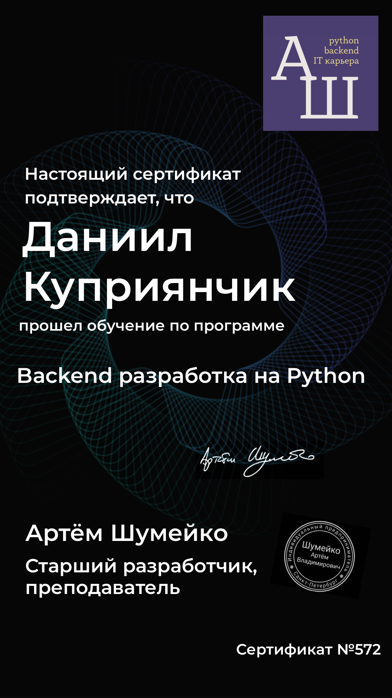

  <h2>Daniil Kupryianchyk</h2> 
  

  
1.5 Years of Non-Commercial Development Experience

  

<table>
  <tr>
    <th style="text-align: center;">🚀 Deployment & Infrastructure</th>
    <th style="text-align: center;">🗄️ Databases</th>
    <th style="text-align: center;">🐍 Backend</th>
    <th style="text-align: center;">🎨 Frontend</th>
    <th style="text-align: center;">🛠️ Other Experience</th>
  </tr>
  <tr>
    <td style="vertical-align: top; text-align: left;">
      <b>Docker</b> 🐳 
      <b>Docker Compose</b> 📦 
      <b>Nginx</b> ⚙️ 
      <b>GitLab CI/CD</b> 🚀 
      <b>VPS</b> 🌍 
      <b>SSL</b> 🔒 
      <b>Yandex Cloud</b> ☁️ 
      <b>Google Cloud</b> ☁️ 
      <b>Git</b> 🌀
    </td>
    <td style="vertical-align: top; text-align: left;">
      <b>MongoDB</b> 🗄️ 
      <b>PostgreSQL</b> 🐘 
      <b>MySQL</b> 💾 
      <b>Redis</b> 🔴
    </td>
    <td style="vertical-align: top; text-align: left;">
      <b>FastAPI</b> ⚡ 
      <b>FastAPI-Mail</b> 📧 
      <b>FastAPI-Cache</b> 🧊 
      <b>SQLAlchemy</b> 🛠️ 
      <b>Celery</b> 🐍 
      <b>Celery Beat</b> ⏱️ 
      <b>Pydantic</b> 📜 
      <b>Jwt</b> 🔑 
      <b>Httpx</b> 🌐 
      <b>AsyncIO</b> 🌀 
      <b>Pytest</b> 🧪 
      <b>Ruff</b> 🦊 
      <b>Strawberry (GraphQL)</b> 🍓 
      <b>Alembic</b> 🏛️ 
      <b>SSE</b> 📡 
      <b>WebSockets</b> 🔗 
      <b>Logging</b> 📝 
      <b>Aiofiles</b> 📂 
      <b>Redis Streams</b> 🌀  
    </td>
    <td style="vertical-align: top; text-align: left;">
      <b>Vue.js</b> 🌐 
      <b>Vue Router</b> 🛣️ 
      <b>Pinia</b> 📦 
      <b>Axios</b> 📡 
      <b>Tailwind CSS</b> 💨
    </td>
    <td style="vertical-align: top; text-align: left;">
      <b>Django</b> 🎭 
      <b>Django REST</b> 🔗 
      <b>Flask</b> 🍶 
      <b>Aiohttp</b> 🌍 
      <b>GitHub CI/CD</b> ⚙️ 
      <b>Aiogram</b> 🤖 
    </td>
  </tr>
</table>

<table style="border-collapse: collapse; border: none;">
  <tr>
    <td style="border: none;">
      
    </td>
    <td style="border: none;">
      
    </td>
    <td style="border: none;">
      
    </td>
  </tr>
</table>

## 🏆 Certifications & Achievements

<table>
  <tr>
<td align="center">
  <a href="https://github.com/shutsuensha/shutsuensha/blob/main/fastapi.pdf" target="_blank">
      
     
    <b>Artem Shumeiko Certification</b>
  </a>
</td>
    <td align="center">
      <a href="https://github.com/shutsuensha/shutsuensha/blob/main/TMS.pdf" target="_blank">
         
        <b>TeachMeSkills Certification</b>
      </a>
    </td>
  </tr>
</table>

  
  
  
  
  

